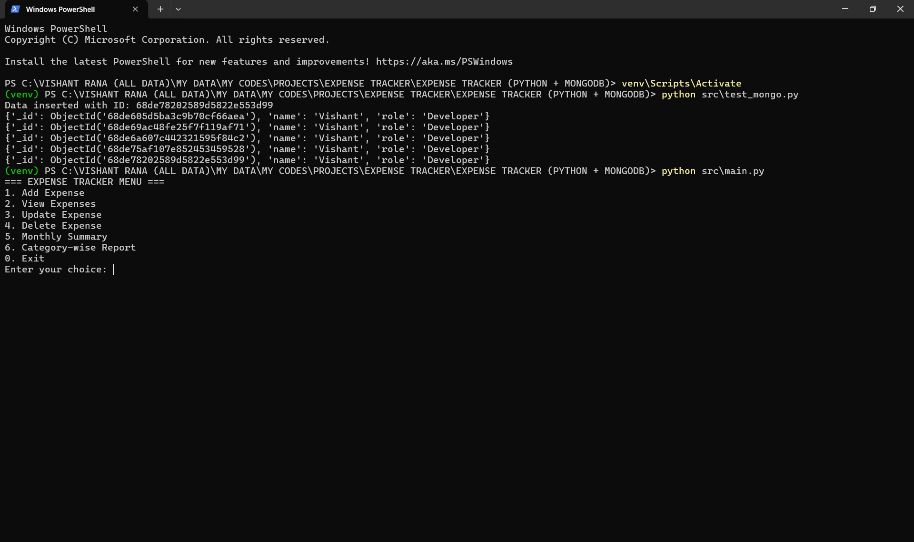
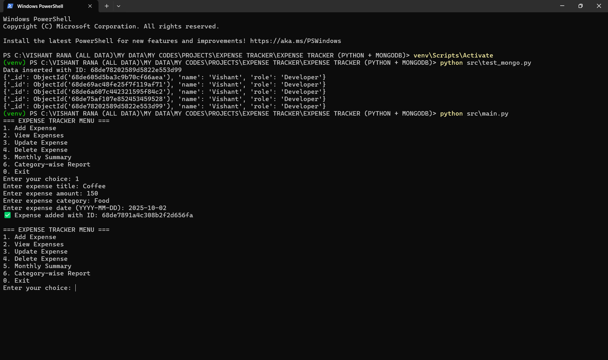
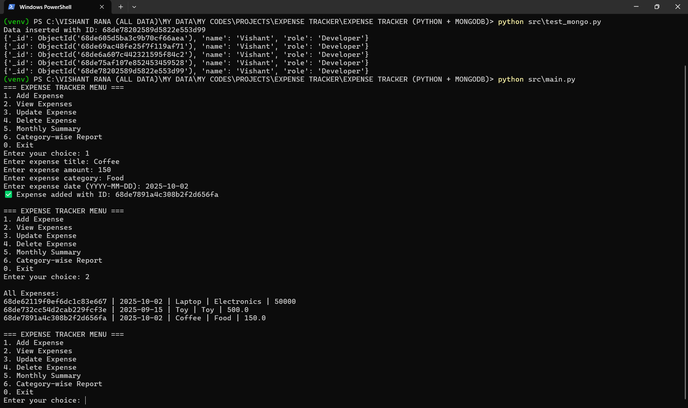
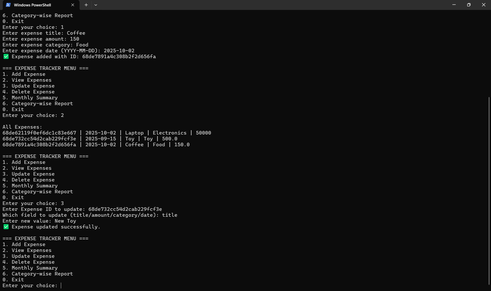
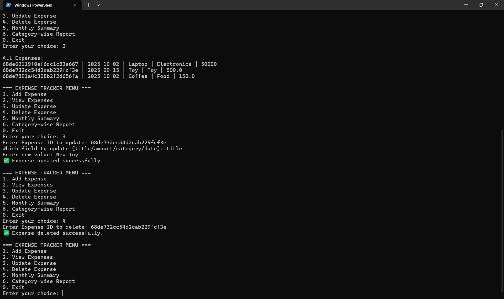
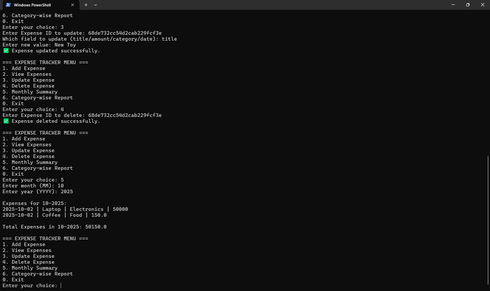
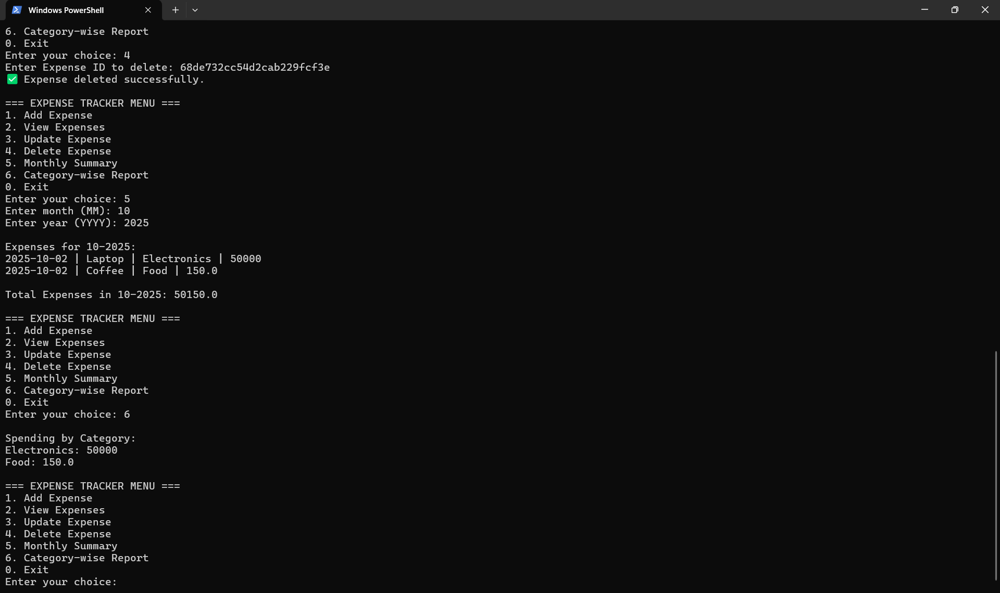
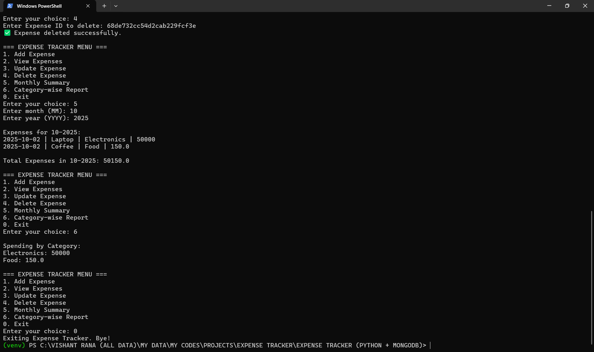
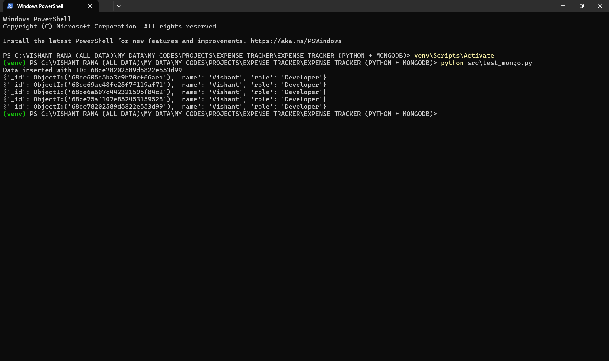

# 📚 Expense Tracker (Python + MongoDB)

## 📝 Description
A backend application to manage daily expenses using Python and MongoDB.  
Supports **CRUD operations**, monthly summaries, category-wise reports, and secure transaction storage.  
Designed with a focus on simplicity, practicality, and insights into spending patterns.

## 🚀 Features
- **CRUD Operations** → Add, View, Update, Delete expenses  
- **Monthly Summary** → Calculate total expenses for a specific month  
- **Category-wise Report** → Track spending per category  
- **MongoDB Integration** → Secure storage of expense data  
- **Environment Variables** → MongoDB URI, DB, and collection stored in `.env`  
- **Modular Python Code**:
    * `main.py` → Core application  
    * `test_mongo.py` → MongoDB connection test  

## 📂 Project Structure
EXPENSE_TRACKER/
│
├── src/
│ ├── main.py
│ └── test_mongo.py
│
├── screenshots/
│ ├── 01_main_menu.png
│ ├── 02_add_expense.png
│ ├── 03_view_expenses.png
│ ├── 04_update_expense.png
│ ├── 05_delete_expense.png
│ ├── 06_monthly_expense.png
│ ├── 07_category_expense.png
│ ├── 08_exit.png
│ └── test_mongo_connection.png
│
├── venv/
├── .env
├── .gitignore
├── requirements.txt
└── README.md

**.env file:**
MONGO_URI=mongodb://localhost:27017/
DB_NAME=Expense_Tracker
COLLECTION_NAME=Expenses

**requirements.txt**
dnspython==2.8.0
pymongo==4.15.2
python-dotenv==1.1.1
tabulate==0.9.0

## ⚙️ Setup & Installation

Step 1 – Clone Repository
git clone git@github.com:vishantrana007/EXPENSE-TRACKER--PYTHON-MONGODB-.git
cd EXPENSE-TRACKER--PYTHON-MONGODB-

Step 2 – Create Virtual Environment
python -m venv venv

Step 3 – Activate Virtual Environment
Windows -:
venv\Scripts\activate

macOS/Linux -:
source venv/bin/activate

Step 4 – Install Dependencies
pip install -r requirements.txt

Step 5 – Setup Environment Variables
Create a .env file in project root with:
MONGO_URI=mongodb://localhost:27017/
DB_NAME=Expense_Tracker
COLLECTION_NAME=Expenses

Step 6 – Test MongoDB Connection
python src/test_mongo.py

Step 7 – Run Application
python src/main.py

## 🖥️ Output Example
✅ MongoDB Connection Successful

=== MAIN MENU ===

Add Expense

View Expenses

Update Expense

Delete Expense

Monthly Summary

Category-wise Report

Exit

=== ADD EXPENSE ===
Enter expense title: Coffee
Enter expense amount: 120
Enter expense category: Food
Enter expense date (YYYY-MM-DD): 2025-10-02
✅ Expense added with ID: 6512ab3c45d6e7f89012abcd

=== VIEW EXPENSES ===
ObjectId('6512ab3c45d6e7f89012abcd') | 2025-10-02 | Coffee | Food | 120.0

=== MONTHLY SUMMARY ===
Expenses for 10-2025:
2025-10-02 | Coffee | Food | 120.0
Total Expenses in 10-2025: 120.0

## 📸 Screenshots

Main Menu  
  

Add Expense  
  

View Expenses  
  

Update Expense  
  

Delete Expense  
  

Monthly Summary  
  

Category-wise Report  
  

Exit Application  
  

MongoDB Test Connection  
  

## 📝 Notes
1. Ensure MongoDB service is running before executing scripts.
2. Store MongoDB URI in .env to keep credentials private.
3. Database name and collection can be modified in .env.
4. Screenshots are in /screenshots folder for reference.
5. Use virtual environment for dependency management.
